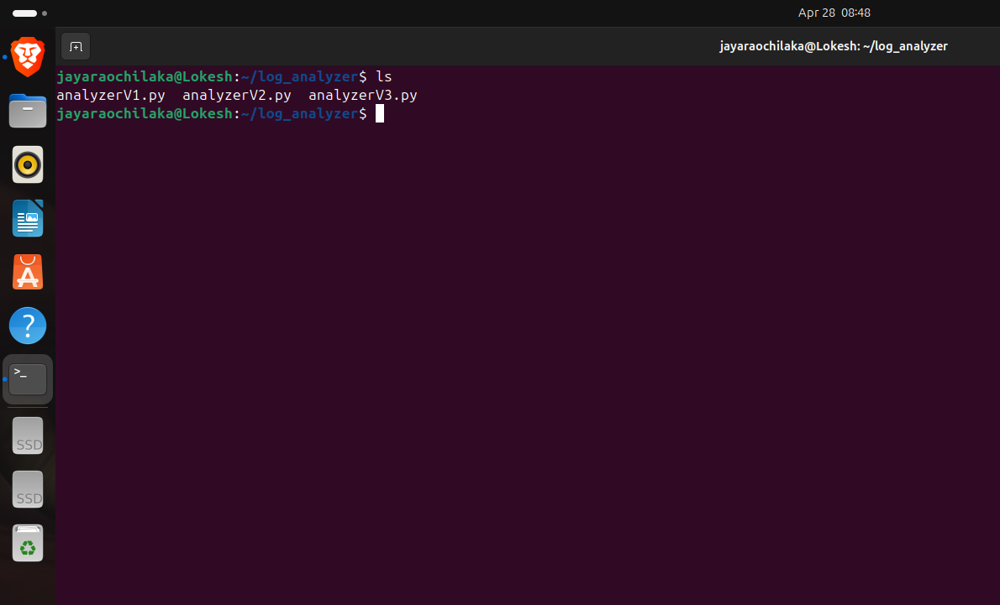

# 🚀 Intelligent Log Analyzer

A Python-based system that analyzes Linux system logs using `journalctl`, detects errors, and generates structured reports.

---

## 📌 Project Overview

Modern Linux systems generate continuous logs through system services. Engineers rely on these logs to:

- 🐞 Debug failures  
- ⚠️ Detect system issues  
- 📊 Monitor system behavior  

This project simulates a **real-world log analysis pipeline**, developed progressively across three versions.

---

## 📂 Project Structure



---

## 🔄 System Workflow

```
Linux Logs (journalctl)
        ↓
📥 Log Collection (subprocess)
        ↓
🔍 Filtering (error / failed detection)
        ↓
📊 Processing (count + classification)
        ↓
📄 Output (terminal + report file)
```

---

# 🧪 Version 1 — Basic Log Extraction


### ⚙️ What it does

- Fetches last 100 system logs using:
  ```bash
  journalctl -n 100
  ```
- Filters lines containing:
  - ❗ error
  - ⚠️ failed
- Prints matching logs
- Displays total count

### 🧠 How it works internally

- Uses `subprocess.getoutput()` to fetch logs  
- Splits logs into lines  
- Iterates through each line  
- Applies simple keyword filtering  

```python
if "error" in line.lower() or "failed" in line.lower():
```

### ❌ Limitations

- No user control  
- No structured output  
- No timestamps  
- No report generation  

---

# ⚙️ Version 2 — Error Classification + Reporting


### ⚙️ What it does

- Takes user input:
  ```
  Enter number of log lines
  ```
- Fetches logs dynamically  
- Separates:
  - ❗ ERROR logs  
  - ⚠️ FAILED logs  
- Counts them individually  
- Saves summary to a file  

### 🧠 How it works internally

#### 🔹 Dynamic log fetching
```python
journalctl -n {n}
```

#### 🔹 Separate counters
```python
error_count += 1
failed_count += 1
```

#### 🔹 Stores matching logs
```python
errors.append(line)
```

#### 🔹 File output
```python
with open("report.txt", "w") as file:
```

### ✅ Improvements over V1

- User-controlled log size  
- Categorization of errors  
- Report generation  
- Better usability  

### ❌ Limitations

- No timestamps  
- No time filtering  
- No structured formatting  

---

# 🧠 Version 3 — Advanced Log Analyzer


### ⚙️ What it does

- User inputs:
  - Number of logs  
  - Output filename  
  - Optional time filtering  
- Supports:
  ```
  journalctl --since "YYYY-MM-DD HH:MM:SS"
  ```
- Extracts:
  - 🕒 Timestamp  
  - 📝 Message  
- Categorizes errors  
- Displays colored output  
- Generates detailed report  

### 🧠 How it works internally

#### 🔹 User Input System
```python
n = input()
filename = input()
choice = input()
```

#### 🔹 Time-Based Filtering
```python
journalctl --since "{time_filter}" -n {n}
```

#### 🔹 Timestamp Extraction
```python
parts = line.split()
timestamp = " ".join(parts[:3])
```

#### 🔹 Structured Data Storage
```python
errors.append((timestamp, message))
```

#### 🔹 Colored Output
```python
RED = "\033[91m"
GREEN = "\033[92m"
```

#### 🔹 Report Generation
```python
file.write(f"Report generated at: {now}")
```

### 🚀 Improvements over V2

- Time filtering (major upgrade)  
- Structured parsing  
- Colored output  
- Professional report  
- Real debugging capability  

---

# 🎯 Key Learning Outcomes

- 🐧 Linux log systems (`journalctl`)  
- 🐍 Python subprocess handling  
- 🔍 Log parsing techniques  
- ⚠️ Error detection systems  
- 📂 File handling  
- 🧠 System debugging concepts  

---

# ▶️ How to Run

```bash
python3 analyzerV1.py
python3 analyzerV2.py
python3 analyzerV3.py
```

---

# 🔮 Future Improvements

- Real-time log monitoring  
- GUI dashboard  
- Machine learning-based anomaly detection  
- Integration with embedded systems  

---

# 📌 Final Note

This project demonstrates a **step-by-step evolution from a basic script to a real system-level debugging tool**, similar to real engineering workflows.

---

## 👨‍💻 Author

Lokesh Jaya Rao Chilaka 
