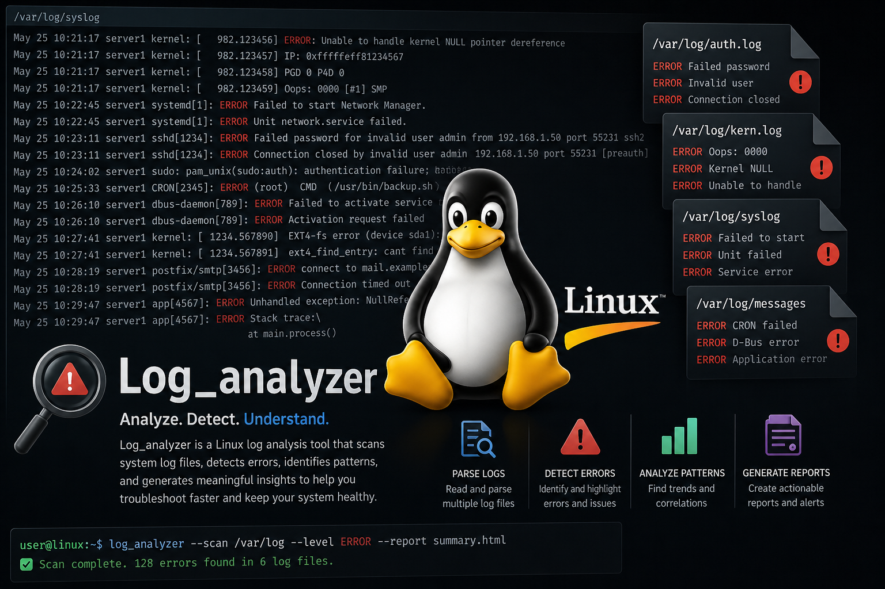
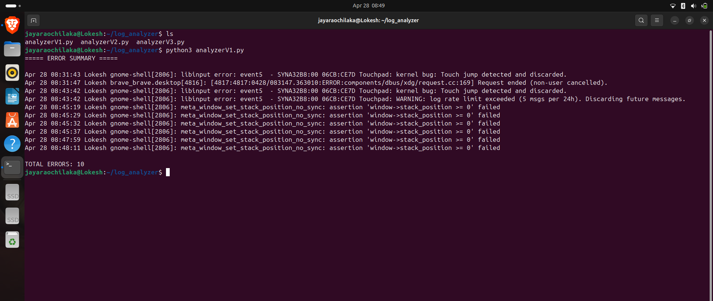
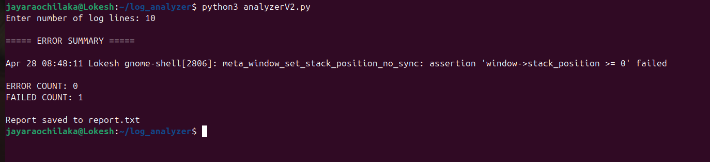
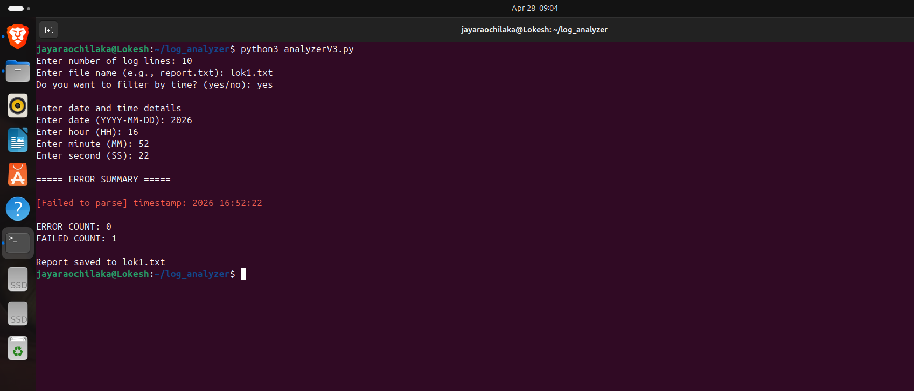

# 🚀 Intelligent Log Analyzer



> 🧠 Analyze • Detect • Understand  
> A Python-based system for analyzing Linux logs using `journalctl` and generating meaningful insights.

---

## 📌 Project Overview

Modern Linux systems generate logs continuously. Engineers rely on these logs to:

- 🐞 Debug failures  
- ⚠️ Detect system issues  
- 📊 Monitor system health  

This project simulates a **real-world log analysis pipeline**, evolving across multiple versions with increasing complexity and capability.

---

## 🗂️ Project Structure


---

## 🔄 System Workflow

```
Linux Logs (journalctl)
        ↓
📥 Log Collection (subprocess)
        ↓
🔍 Filtering (error / failed detection)
        ↓
📊 Processing (classification & counting)
        ↓
📄 Output (terminal + report file)
```

---

# 🧪 Version 1 — Basic Log Extraction



### ⚙️ Features

- Fetches last 100 system logs:
  ```bash
  journalctl -n 100
  ```
- Filters logs containing:
  - ❗ error  
  - ⚠️ failed  
- Displays matching logs and total count  

### 🧠 Internal Logic

```python
if "error" in line.lower() or "failed" in line.lower():
```

### ❌ Limitations

- No user input  
- No structured output  
- No timestamps  
- No report generation  

---

# ⚙️ Version 2 — Structured Analysis & Reporting



### ⚙️ Features

- Accepts user input for number of logs  
- Separates:
  - ❗ ERROR logs  
  - ⚠️ FAILED logs  
- Counts occurrences  
- Generates report file (`report.txt`)  

### 🧠 Internal Logic

```python
journalctl -n {n}
```

```python
error_count += 1
failed_count += 1
```

```python
with open("report.txt", "w") as file:
```

### 🚀 Improvements

- User-controlled execution  
- Categorized results  
- File-based reporting  

### ❌ Limitations

- No timestamp parsing  
- No time-based filtering  
- Limited structure  

---

# 🧠 Version 3 — Intelligent Log Analyzer



### ⚙️ Features

- User inputs:
  - Number of logs  
  - Output filename  
  - Optional time filter  
- Supports:
  ```bash
  journalctl --since "YYYY-MM-DD HH:MM:SS"
  ```
- Extracts:
  - 🕒 Timestamp  
  - 📝 Message  
- Displays colored terminal output  
- Generates detailed structured reports  

### 🧠 Internal Logic

```python
n = input()
filename = input()
choice = input()
```

```python
journalctl --since "{time_filter}" -n {n}
```

```python
errors.append((timestamp, message))
```

```python
RED = "\033[91m"
GREEN = "\033[92m"
```

```python
file.write(f"Report generated at: {now}")
```

### 🚀 Improvements

- Time-based filtering  
- Structured data parsing  
- Enhanced readability (color output)  
- Professional reporting system  

---

# 🎯 Key Learning Outcomes

- 🐧 Linux log systems (`journalctl`)  
- 🐍 Python subprocess handling  
- 🔍 Log parsing and filtering  
- ⚠️ Error classification  
- 📂 File handling & reporting  
- 🧠 System debugging concepts  

---

## ▶️ How to Run


python3 analyzerV1.py

👉 [View Code](analyzerV1.py)

python3 analyzerV2.py

👉 [View Code](analyzerV2.py)

python3 analyzerV3.py

👉 [View Code](analyzerV3.py)


---

# 🔮 Future Improvements

- ⏱️ Real-time log monitoring  
- 🖥️ GUI dashboard  
- 🤖 ML-based anomaly detection  
- 🔗 Integration with embedded / robotic systems  

---

# Final Note

This project demonstrates a **progressive evolution** from a basic script to an intelligent system-level tool — similar to real-world engineering development workflows.

---

## 👨‍💻 Author

**Lokesh Jaya Rao**
